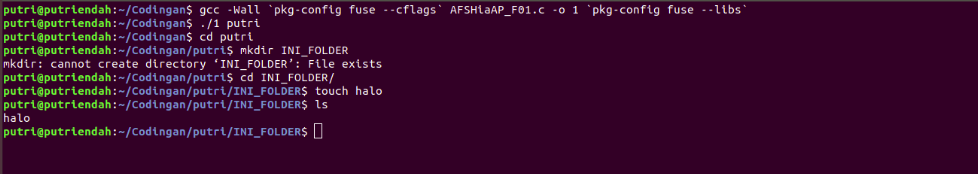

# Laporan Resmi Sisop Modul 4 F01

1. Putri Endah Puspitasari (05111740000039)<br>
2. Garda Negara Wisnumurti (05111740000153)

## sisop-modul-4

### Objectives
1. Peserta mengetahui _file system_
2. Peserta mengetahui dan mampu mengimplementasikan FUSE

### Daftar Isi
- [1. File System](https://github.com/dnirmalasari18/sisop-modul-4#1-file-system)
  - [1.1 Tipe File System](https://github.com/dnirmalasari18/sisop-modul-4#11-tipe-file-system)
  - [1.2 Virtual File System](https://github.com/dnirmalasari18/sisop-modul-4#12-virtual-file-system)
  - [1.3 Dentry](https://github.com/dnirmalasari18/sisop-modul-4#13-dentry)
  - [1.4 Superblock](https://github.com/dnirmalasari18/sisop-modul-4#14-superblock)
  - [1.5 Inode](https://github.com/dnirmalasari18/sisop-modul-4#15-inode)
- [2. File System in Userspace (FUSE)](https://github.com/dnirmalasari18/sisop-modul-4#2-file-system-in-userspace-fuse)
  - [2.1 Instalasi Fuse](https://github.com/dnirmalasari18/sisop-modul-4#21-instalasi-fuse)
  - [2.2 Membuat File System dengan Fuse](https://github.com/dnirmalasari18/sisop-modul-4#22-membuat-file-system-dengan-fuse)

## 1. File System
_File system_ adalah struktur logika yang digunakan untuk mengendalikan akses data seperti bagaimana dia disimpan maupun diambil. _File system_ sendiri memiliki banyak jenis dengan penggunaan algoritma yang tentu berbeda.

#### 1.1 Tipe File System
**1. File System Disk**

_File system disk_ adalah _file system_ yang didesain untuk menyimpan data pada sebuah media penyimpan data. Contohnya: FAT (FAT 12, FAT 16, FAT 320), NTFS, HFS, HFS+, ext2, ext3, ext4, ISO 9660, ODS-5 dan UDF.

**2. File System Flash**

_File system flash_ adalah _file system_ yang didesain untuk menyimpan data pada media _flash memory_. Hal ini menjadi lazim ketika jumlah perangkat mobile semakin banyak dan kapasitas _memory flash_ yang semakin besar.

**3. File System Database**

Konsep baru untuk manajemen _file_ adalah konsep _file system_ berbasis _database_. Sebagai perbaikan bagi Manajemen terstruktur hirarkis, file diidentifikasi oleh karakteristiknya, seperti tipe _file_, topik, pembuat, atau metadata yang sama.

**4. File System Transaksional**

Setiap operasi _disk_ dapat melibatkan perubahan ke sejumlah _file_ dan _struktur disk_ yang berbeda. Dalam
banyak kasus, perubahan ini berhubungan. Hal ini berarti bahwa operasi ini dieksekusi pada waktu yang sama.

**5. File System Jaringan**

_File system_ jaringan adalah _file system_ yang bertindak sebagai klien untuk protokol akses file jarak jauh, memberikan akses ke _file_ pada sebuah _server_. Contoh dari _file system_ jaringan ini adalah klien protokol NFS, AFS, SMB, dan klien FTP dan WebDAV.

**6. File System untuk Tujuan Khusus**

_File system_ untuk tujuan khusus adalah _file system_ yang tidak termasuk _disk file system_ atau _file system_ jaringan. Yang termasuk dalam kategori ini adalah sistem di mana file ditata secara dinamis oleh _software_, ditujukan untuk tujuan tertentu seperti untuk komunikasi antar proses komputer atau _space file_ sementara. Contohnya _file system procfs_ (/proc) yang dipakai oleh beberapa varian Unix.

**7. File System Journaling**

_File system_ yang mencatat perubahan ke dalam jurnal (biasanya berupa log sirkular dalam area tertentu) sebelum melakukan perubahan ke _file system_. File sistem seperti ini memiliki kemungkinan yang lebih kecil mengalami kerusakan saat terjadi _power failure_ atau _system crash_.

#### 1.2 Virtual File System
Virtual file system adalah suatu lapisan perangkat lunak dalam kernel yang menyediakan _interface file system_ untuk program _user space_. _Virtual file system_ berfungsi agar berbagai jenis _file system_ dapat diakses oleh aplikasi komputer dengan cara yang seragam. VFS menyediakan antarmuka antara _system call_ dengan sistem yang sesungguhnya.

#### 1.3 Dentry
Dentry atau _Directory Entry_ merupakan sebuah struktur data yang memiliki tugas sebagai penerjemah nama berkas ke inode-nya. Contoh informasi yang disimpan dalam dentry adalah _name_, _pointer to inode_, _pointer to parent dentry_, _use count_, dan lainnya. Adapula command dalam VFS dentry adalah D_compare, D_delete, D_release.

#### 1.4 Superblock
Setiap _file system_ yang di-_mount_ akan direpresentasikan oleh sebuah VFS Superblock. _Superblock_ digunakan untuk menyimpan informasi mengenai partisi tersebut. _Superblock_ menyimpan informasi sebagai berikut:
- _Device_: Merupakan _device identifier_, contohnya /dev/hda1 adalah _harddisk_ pertama yang terdapat pada sistem memiliki device identifier 0×300.
- _Inode Pointer_: Merupakan suatu _pointer_ yang menunjuk ke inode pertama pada sistem berkas.
- _Blocksize_: Menunjukkan ukuran suatu _block_ dari sistem berkas, contohnya 1024 _bytes_.
- _Superblock Operation_: Merupakan suatu pointer ke sekumpulan _superblock routine_ (fungsi) dari _file system_, contohnya _read_, _write_, dan sebagainya.
- _File System Type_: Menunjukkan tipe dari _file system_, contoh: EXT2, FAT, NTFS.
- _File System Specific_: Merupakan suatu pointer ke informasi yang dibutuhkan oleh _file system.

#### 1.5 Inode
Inode adalah abstraksi VFS untuk berkas. Setiap berkas, _directory_, dan data lainnya pada VFS direpresentasikan oleh satu dan hanya satu VFS inode. VFS inode hanya terdapat di memori kernel dan disimpan di inode chace selama masih dibutuhkan oleh sistem. Informasi yang disimpan oleh VFS Inode diantaranya:
- _Device_: Menunjukan device identifier dari suatu device yang menyimpan berkas ataupun _directory_.
- _Inode Number_: Merupakan nomor inode yang unik dalam _file system_.
- Mode: Menggambarkan apa yang direpresentasikan oleh VFS inode.
- _User_ ID: Merupakan identifier bagi pemilik berkas.
- _Time_: Menunjukkan kapan pembuatan, modifikasi, dan penulisan suatu berkas.
- _Blocksize_: Menunjukkan ukuran dari _block_ yang digunakan oleh berkas.
- _Inode Operations_: Merupakan _pointer_ ke suatu _routine_ yang melakukan berbagai operasi pada inode.
- _Count_: Menunjukkan berapa kali suatu sistem telah menggunakan suatu inode.
- _Lock_: Digunakan untuk mengunci VFS inode.
- _File System Specific Information_: Menunjukkan informasi khusus yang dibutuhkan oleh suatu inode.

## 2. File System in Userspace (FUSE)
FUSE (Filesystem in Userspace) adalah sebuah _interface_ dimana kita dapat membuat _file system_ sendiri pada _userspace_ pada linux.

Keuntungan menggunakan FUSE ialah kita dapat menggunakan _library_ apapun yang tersedia untuk membuat _file system_ sendiri tanpa perlu mengenali secara mendalam apa yang _file system_ sebenarnya lakukan di _kernel space_. Hal ini dilakukan karena modul FUSE yang dapat menjembatani antara kode _file system_ yang berada pada _userspace_ dengan _file system_ yang berada pada _kernel space_.


#
Salah satu contoh yang menarik dari FUSE adalah [GDFS][7bb7b7cc] (Google Drive File System), dimana GDFS ini memungkinkan kita untuk me-_mount Google Drive_ kita ke sistem linux dan menggunakannya seperti file linux biasa.

  [7bb7b7cc]: https://github.com/robin-thomas/GDFS "GDFS"

Untuk mengimplementasikan FUSE ini, kita harus membuat sebuah program yang terhubung dengan *library* ```libfuse```. Tujuan dari program yang dibuat ini adalah menspesifikkan bagaimana *file system* merespon *read/write/stat* dari sebuah *request* dan untuk me-*(mount)* *file system* asli *(kernel space)* ke *file system* yang baru *(userspace)*. Jadi di saat *user* berurusan dengan *read/write/stat request* di *file system (userspace)*, kernel akan meneruskan *input output request* tersebut ke program FUSE dan program tersebut akan merespon kembali ke *user*.

Untuk lebih jelasnya mari kita coba membuat program FUSE.

###### Instalasi FUSE
Pertama-tama kita harus memstikan bahwa FUSE sudah ter-install di perangkat anda
```
$ sudo apt update
$ sudo apt install libfuse*
```

###### Cara Kerja FUSE:

- ```fuse_main()``` (lib/helper.c) = sebagain fungsi main (userspace), program user memanggil fungsi fuse_main() kemudian fungsi fuse_mount() dipanggil.
- ```fuse_mount()``` (lib/mount.c) = menciptakan UNIX domain socket, kemudian di fork dan menciptakan child process yang menjalankan fusermount
- ```fusermount()``` (util/fusermount.c) = untuk mengecek apakah modul FUSE sudah di load. Kemudian membuka /dev/fuse dan mengirim file handle melalu UNIX domain socket kembali ke fungsi fuse_mount()
- ```fuse_new()``` (lib/fuse.c) = menciptakan struktur data yang berisi ruang yang digukanan untuk menyimpan data file system
- ```fuse_loop()``` (lib/fuse.c) = membaca file system calls dari /dev/fuse

Ini adalah beberapa fungsi yang disediakan oleh **FUSE**:
```c
	int (*getattr) (const char *, struct stat *);
	//Get file attributes.

	int (*readlink) (const char *, char *, size_t);
	//Read the target of a symbolic link
	
	int (*mknod) (const char *, mode_t, dev_t);
	//Create a file node. 

	int (*mkdir) (const char *, mode_t);
	//Create a directory.

	int (*unlink) (const char *);
	//Remove a file

	int (*rmdir) (const char *);
	//Remove a directory

	int (*rename) (const char *, const char *);
	//Rename a file

	int (*chmod) (const char *, mode_t);
	//Change the permission bits of a file

	int (*chown) (const char *, uid_t, gid_t);
	//Change the owner and group of a file

	int (*truncate) (const char *, off_t);
	//Change the size of a file

	int (*open) (const char *, struct fuse_file_info *);
	//File open operation.

	int (*readdir) (const char *, void *, fuse_fill_dir_t, off_t, struct fuse_file_info *);
	//Read directory

	int (*read) (const char *, char *, size_t, off_t, struct fuse_file_info *);
	//Read data from an open file

	int (*write) (const char *, const char *, size_t, off_t, struct fuse_file_info *);
	//Write data to an open file
```

###### Membuat Program FUSE
Fuse memiliki ```struct``` yang dinamakan ```fuse_operations``` yang didefinisikan seperti dibawah ini:
```c
static struct fuse_operations xmp_oper = {
	.getattr	= xmp_getattr,
	.access		= xmp_access,
	.readlink	= xmp_readlink,
	.readdir	= xmp_readdir,
	.mknod		= xmp_mknod,
	.mkdir		= xmp_mkdir,
	.symlink	= xmp_symlink,
	.unlink		= xmp_unlink,
	.rmdir		= xmp_rmdir,
	.rename		= xmp_rename,
	.link		= xmp_link,
	.chmod		= xmp_chmod,
	.chown		= xmp_chown,
	.truncate	= xmp_truncate,
	.utimens	= xmp_utimens,
	.open		= xmp_open,
	.read		= xmp_read,
	.write		= xmp_write,
	.statfs		= xmp_statfs,
	.create         = xmp_create,
	.release	= xmp_release,
	.fsync		= xmp_fsync,
  	.setxattr	= xmp_setxattr,
	.getxattr	= xmp_getxattr,
	.listxattr	= xmp_listxattr,
	.removexattr	= xmp_removexattr,
#endif
};
```
Semua atribut pada ```struct``` tersebut adalah _pointer_ yang menuju ke fungsi. Setiap fungsi tersebut disebut FUSE saat suatu kejadian yang spesifik terjadi di *file system*. Sebagai contoh saat _user_ menulis di sebuah file, sebuah fungsi yang ditunjuk oleh atribut "write" di ```struct``` akan terpanggil.

Selain itu, atribut pada ```struct``` tersebut tertulis seperti fungsi yang biasa digunakan di linux. Contohnya ialah saat kita membuat _directory_ di FUSE maka fungsi mkdir akan dipanggil.

**Untuk mengimplementasikan FUSE**, kita harus menggunakan ```struct``` ini dan harus mendefinisikan fungsi yang ada di dalam ```struct``` tersebut. Setelahnya, kita mengisi ```struct``` tersebut dengan pointer dari fungsi yang ingin diimplementasikan. 

Kebanyakan fungsi-fungsi yang tersedia adalah **opsional**, kita tidak perlu mengimplementasikan semuanya. Beberapa fungsi memang harus diimplementasikan dalam _file system_. Fungsi-fungsi tersebut antara lain:
- Fungsi ```getattr``` yang dipanggil saat sistem mencoba untuk mendapatkan atribut dari sebuah file.
- Fungsi ```readdir``` yang dipanggil saat user mencoba untuk menampilkan file dan direktori yang berada pada suatu direktori yang spesifik.
- Fungsi ```read``` yang dipanggil saat sistem mencoba untuk membaca potongan demi potongan data dari suatu file.

Contoh program FUSE sederhanaa yang hanya menggunakan 3 fungsi tersebut.
```c
#define FUSE_USE_VERSION 28
#include <fuse.h>
#include <stdio.h>
#include <string.h>
#include <unistd.h>
#include <fcntl.h>
#include <dirent.h>
#include <errno.h>
#include <sys/time.h>

static int xmp_getattr(const char *path, struct stat *stbuf)
{
	int res;

	res = lstat(path, stbuf);
	if (res == -1)
		return -errno;

	return 0;
}

static int xmp_readdir(const char *path, void *buf, fuse_fill_dir_t filler,
		       off_t offset, struct fuse_file_info *fi)
{
	DIR *dp;
	struct dirent *de;

	(void) offset;
	(void) fi;

	dp = opendir(path);
	if (dp == NULL)
		return -errno;

	while ((de = readdir(dp)) != NULL) {
		struct stat st;
		memset(&st, 0, sizeof(st));
		st.st_ino = de->d_ino;
		st.st_mode = de->d_type << 12;
		if (filler(buf, de->d_name, &st, 0))
			break;
	}

	closedir(dp);
	return 0;
}

static int xmp_read(const char *path, char *buf, size_t size, off_t offset,
		    struct fuse_file_info *fi)
{
	int fd;
	int res;

	(void) fi;
	fd = open(path, O_RDONLY);
	if (fd == -1)
		return -errno;

	res = pread(fd, buf, size, offset);
	if (res == -1)
		res = -errno;

	close(fd);
	return res;
}

static struct fuse_operations xmp_oper = {
	.getattr	= xmp_getattr,
	.readdir	= xmp_readdir,
	.read		= xmp_read,
};

int main(int argc, char *argv[])
{
	umask(0);
	return fuse_main(argc, argv, &xmp_oper, NULL);
}

```

Setelah itu kode dapat di-_compile_ dengan cara

```
gcc -Wall `pkg-config fuse --cflags` [file.c] -o [output] `pkg-config fuse --libs`
```

Lalu buat sebuah direktori sebagai tujuan pembuatan FUSE dan menjalankan FUSE pada direktori tersebut.
```
$ mkdir [direktori tujuan]
$ ./[output] [direktori tujuan]
```
Setelah program dijalankan, masuklah kedalam direktori tujuan tersebut. Isi dari direktori tersebut adalah list folder yang sama seperti yang ada di dalam ```root``` atau ```/```.

Sesuai dengan penjelasan di awal di mana FUSE dapat memodifikasi _file system_ di _userspace_ tanpa perlu mengubah kode yang ada pada kernel, di sini kita coba memodifikasi kode FUSE tadi agar FUSE tersebut menampilkan apa yang ada di dalam folder ```/home/[user]/Documents```.
Ubah kode FUSE tadi seperti yang ada dibawah ini:

```c
#define FUSE_USE_VERSION 28
#include <fuse.h>
#include <stdio.h>
#include <string.h>
#include <unistd.h>
#include <fcntl.h>
#include <dirent.h>
#include <errno.h>
#include <sys/time.h>

static const char *dirpath = "/home/[user]/Documents";

static int xmp_getattr(const char *path, struct stat *stbuf)
{
  int res;
	char fpath[1000];
	sprintf(fpath,"%s%s",dirpath,path);
	res = lstat(fpath, stbuf);

	if (res == -1)
		return -errno;

	return 0;
}

static int xmp_readdir(const char *path, void *buf, fuse_fill_dir_t filler,
		       off_t offset, struct fuse_file_info *fi)
{
  char fpath[1000];
	if(strcmp(path,"/") == 0)
	{
		path=dirpath;
		sprintf(fpath,"%s",path);
	}
	else sprintf(fpath, "%s%s",dirpath,path);
	int res = 0;

	DIR *dp;
	struct dirent *de;

	(void) offset;
	(void) fi;

	dp = opendir(fpath);
	if (dp == NULL)
		return -errno;

	while ((de = readdir(dp)) != NULL) {
		struct stat st;
		memset(&st, 0, sizeof(st));
		st.st_ino = de->d_ino;
		st.st_mode = de->d_type << 12;
		res = (filler(buf, de->d_name, &st, 0));
			if(res!=0) break;
	}

	closedir(dp);
	return 0;
}

static int xmp_read(const char *path, char *buf, size_t size, off_t offset,
		    struct fuse_file_info *fi)
{
  char fpath[1000];
	if(strcmp(path,"/") == 0)
	{
		path=dirpath;
		sprintf(fpath,"%s",path);
	}
	else sprintf(fpath, "%s%s",dirpath,path);
	int res = 0;
  int fd = 0 ;

	(void) fi;
	fd = open(fpath, O_RDONLY);
	if (fd == -1)
		return -errno;

	res = pread(fd, buf, size, offset);
	if (res == -1)
		res = -errno;

	close(fd);
	return res;
}

static struct fuse_operations xmp_oper = {
	.getattr	= xmp_getattr,
	.readdir	= xmp_readdir,
	.read		= xmp_read,
};

int main(int argc, char *argv[])
{
	umask(0);
	return fuse_main(argc, argv, &xmp_oper, NULL);
}

```

### Soal Latihan
1. Buat sebuah file sistem yang kamu buat ke /home/[user]/Downloads, lalu ubah nama file yang ada pada folder tersebut menjadi ```[nama file].[ekstensi].bak```. File .bak tersebut hanya dapat dibaca.
2. Buat sebuah file system yang mengarah ke /home/[user]/Documents. Pada saat membuka file dengan ekstensi .pdf, .doc, .txt pada direktori Documents akan muncul pesan error “Terjadi kesalahan! File berisi konten berbahaya.” dan tidak dapat membaca file tersebut. Setelah memunculkan pesan error, file tersebut diganti namanya menjadi ```<namafile>.<ekstensi>.ditandai```. Setelah memunculkan pesan error dan mengganti nama file tadi, file tersebut otomatis dipindahkan ke direktori ```rahasia```. Jika folder rahasia belum ada, maka secara otomatis akan membuat direktori “rahasia” sebelum dipindahkan dan file tidak bisa di read write execute.


#### References
1. https://www.cs.hmc.edu/~geoff/classes/hmc.cs135.201109/homework/fuse/fuse_doc.html
2. http://www.maastaar.net/fuse/linux/filesystem/c/2016/05/21/writing-a-simple-filesystem-using-fuse/
3. https://github.com/asayler/CU-CS3753-PA5
4. http://amazingharry.blogspot.co.id/2015/01/filesystem-in-userspace-fuse-in-linux_5.html


## Jawaban Soal Latihan


## SoalShift_modul4_F01

Suatu ketika King of YouTube ASEAN, Atta Halilintar, mengunjungi laboratorium AJK karena urusan yang benar-benar genting. 
Prestasi dan ketenarannya ternyata menarik perhatian hacker yang ingin mencuri video-video berkualitas milik Atta, bahkan ingin mencuri password akun YouTube miliknya. 
Menurut intel Atta, pemimpin hacker yang berusaha menyerangnya adalah :

Hacker tersebut menyusup ke dalam file system yang ada di dalam PC Atta dengan mudah karena ternyata file system tersebut sama sekali tidak memiliki sistem pengamanan. Maka dari itu maksud Atta ke laboratorium AJK karena dia ingin kalian untuk mengembangkan file system yang aman.

Atta menginginkan nama file system yang akan kalian buat adalah “__AFSHiaAP__”, yang nama kepanjangannya adalah AHHA’s File System: Hierarchical and Advanced Protection. Berikut ini kebutuhan yang harus kalian penuhi:

### Soal 1
Semua nama file dan folder harus terenkripsi
Enkripsi yang Atta inginkan sangat sederhana, yaitu Caesar cipher. Namun, Kusuma mengatakan enkripsi tersebut sangat mudah dipecahkan. Dia menyarankan untuk character list diekspansi,tidak hanya alfabet, dan diacak. Berikut character list yang dipakai :

```qE1~ YMUR2"`hNIdPzi%^t@(Ao:=CQ,nx4S[7mHFye#aT6+v)DfKL$r?bkOGB>}!9_wV']jcp5JZ&Xl|\8s;g<{3.u*W-0```

Misalkan ada file bernama “halo” di dalam folder “INI_FOLDER”, dan key yang dipakai adalah 17, maka:

__“INI_FOLDER/halo”__ saat belum di-mount maka akan bernama __“n,nsbZ]wio/QBE#”__, saat telah di-mount maka akan otomatis terdekripsi kembali menjadi __“INI_FOLDER/halo”__ .
Perhatian: Karakter ‘/’ adalah karakter ilegal dalam penamaan file atau folder dalam *NIX, maka dari itu dapat diabaikan

#### Jawaban & Penjelasan :

Dari soal kita diminta untuk meng-enkrip kan suatu nama folder atau file dengan Caesar cipher, semua folder dan file yang dibuat akan ter enkripsi sebelum program di mount, setelah program di mount maka akan ter dekripsi. Dalam penggunaan Caesar cipher menggunakan key yaitu kunci yang digunakan untuk memudahkan proses enkripsi dan dekripsi. Berdasarkan enkripsi dekripsi Caesar cipher kita dapatkan rumus sebagai berikut :

* Enkripsi : (indeks + key) mod (jml_list)

* Dekripsi : (indeks + (jml_list - key)) mod (jml_key)

Indeks merupakan huruf yang di inputkan itu indeks ke berapa di list yang sudah di sediakan.
Sehingga kita dapatkan suatu source code untuk Enkripsi nya yaitu :

* Enkripsi :

```javascript
void enkripsi(char* kata)
{
    char dasar[100] = "qE1~ YMUR2\"`hNIdPzi%^t@(Ao:=CQ,nx4S[7mHFye#aT6+v)DfKL$r?bkOGB>}!9_wV']jcp5JZ&Xl|\\8s;g<{3.u*W-0";
    for(int i=0; i<strlen(kata); i++){
        for(int j = 0 ; j<strlen(dasar); j++){
            if(kata[i] == dasar[j]){
                int indeks_baru = (j+17) % 94;
                kata[i] = dasar[indeks_baru];
                break;
            }
        }
    }
}
```
Dari source code diatas kita hitung dulu panjang kata yang akan di inputkan dengan ```  for(int i=0; i<strlen(kata); i++){ ``` jika i kurang dari panjang inputan kata dan j kurang dari panjang list dasar maka 

```if(kata[i] == dasar[j]){``` jika kata ke i sama dengan dasar ke j maka menggunakan rumus enkripsi yaitu 

``` int indeks_baru = (j+17) % 94;``` indeks baru sama dengan j + 17 sebagai key di mod 94 yaitu banyaknya karakter dasar.

``` kata[i] = dasar[indeks_baru];``` maka kata i berubah menjadi dasar ke indeks yang baru, sama seperti penjelasan saya sebelumnya.

* Dekripsi :

```javascript
void dekripsi(char* kata)
{
    char dasar[100] = "qE1~ YMUR2\"`hNIdPzi%^t@(Ao:=CQ,nx4S[7mHFye#aT6+v)DfKL$r?bkOGB>}!9_wV']jcp5JZ&Xl|\\8s;g<{3.u*W-0";
    for(int i=0; i<strlen(kata); i++){
        for(int j = 0 ; j<strlen(dasar); j++){
            if(kata[i] == dasar[j]){
                int indeks_baru = (j+(94-17)) % 94;
                kata[i] = dasar[indeks_baru];
                break;
            }
        }
    }
}
```
Sama seperti halnya dengan enkripsi, dekripsi pun juga sama hanya saja berbeda pada rumus nya saja.

Dari source code diatas kita hitung dulu panjang kata yang akan di inputkan dengan ```  for(int i=0; i<strlen(kata); i++){ ``` jika i kurang dari panjang inputan kata dan j kurang dari panjang list dasar maka 

```if(kata[i] == dasar[j]){``` jika kata ke i sama dengan dasar ke j maka menggunakan rumus enkripsi yaitu 

``` int indeks_baru = (j+(94-17)) % 94;``` indeks baru sama dengan j + 94 dikurang 17 sebagai key kemudian di mod 94 yaitu banyaknya karakter dasar.

``` kata[i] = dasar[indeks_baru];``` maka kata i berubah menjadi dasar ke indeks yang baru, sama seperti penjelasan saya sebelumnya.

Kemudian pada setiap fungsi di tambahkan source code berikut 

```javascript
char fpath[1000];
	char sementara[1000];
    sprintf(sementara,"%s",path);

    enkripsi(sementara);
	sprintf(fpath, "%s%s",dirpath,sementara);
```

``` sprintf(sementara,"%s",path);``` simpan path pada variabel sementara.

```enkripsi(sementara);``` agar yang terenkripsi nantinya adalah folder dan file yang ada di sementara.

```sprintf(fpath, "%s%s",dirpath,sementara);``` kemudian path keseluruhannya ditambah dengan path sememntara di simpan di variabel bernama fpath.

Berikut merupakan screenshot an hasil dari jawaban nomor 1 :



### Soal 2
Semua file video yang tersimpan secara terpecah-pecah (splitted) harus secara otomatis tergabung (joined) dan diletakkan dalam folder “Videos”
Urutan operasi dari kebutuhan ini adalah:

a. Tepat saat sebelum file system di-mount

   i.   Secara otomatis folder “Videos” terbuat di root directory file system
   
   ii.  Misal ada sekumpulan file pecahan video bernama “computer.mkv.000”,         “computer.mkv.001”, “computer.mkv.002”, dst. Maka         secara otomatis file pecahan tersebut akan di-join menjadi file video “computer.mkv”
Untuk mempermudah kalian, dipastikan hanya video file saja yang terpecah menjadi beberapa file. File pecahan tersebut dijamin terletak di root folder fuse

  iii.  Karena mungkin file video sangat banyak sehingga mungkin saja saat menggabungkan file video, file system akan membutuhkan waktu yang lama untuk sukses ter-mount. Maka pastikan saat akan menggabungkan file pecahan video, file system akan membuat __1 thread/proses(fork) baru__ yang dikhususkan untuk menggabungkan file video tersebut

   iv.   Pindahkan seluruh file video yang sudah ter-join ke dalam folder “Videos”
   
   v.    Jangan tampilkan file pecahan di direktori manapun
   
b. Tepat saat file system akan di-unmount

  i.    Hapus semua file video yang berada di folder “Videos”, tapi jangan hapus file pecahan yang terdapat di root directory file system
  
  ii.   Hapus folder “Videos”

### Soal 3
Sebelum diterapkannya file system ini, Atta pernah diserang oleh hacker LAPTOP_RUSAK yang menanamkan user bernama “chipset” dan “ic_controller” serta group “rusak” yang tidak bisa dihapus. Karena paranoid, Atta menerapkan aturan pada file system ini untuk menghapus “file bahaya” yang memiliki spesifikasi:

  - Owner Name 	: ‘chipset’ atau ‘ic_controller’
  - Group Name	: ‘rusak’
  - Tidak dapat dibaca
  
Jika ditemukan file dengan spesifikasi tersebut ketika membuka direktori, Atta akan menyimpan nama file, group ID, owner ID, dan waktu terakhir diakses dalam file “filemiris.txt” (format waktu bebas, namun harus memiliki jam menit detik dan tanggal) lalu menghapus “file bahaya” tersebut untuk mencegah serangan lanjutan dari LAPTOP_RUSAK.

#### Jawaban & Penjelasan

Berdasarkan soal kita diminta untuk menghapus file yang memiliki user `chipset` atau `ic_controller` dan group name nya `rusak` serta file tersebut tidak dapat dibaca denga kata lain file tersebut mempunyai permission 0000.

```javascript
struct passwd *user;
        user = getpwuid(info.st_uid);
        struct group *grup;
        grup = getgrgid(info.st_gid);
        if( (strcmp(user->pw_name,"chipset") == 0 || strcmp(user->pw_name,"ic_controller") == 0) && strcmp(grup->gr_name,"rusak") == 0){
          if((info.st_mode & R_OK)==0){
              char txt[10000] = "/filemiris.txt";
              enkripsi(txt);
              char pathtxt[100000];
              sprintf(pathtxt,"%s%s",dirpath,txt);

              FILE *filetxt;
              filetxt = fopen(pathtxt,"a+");

              char waktu[21];
			  time_t now = time(NULL);
			  strftime(waktu, 20, "%H:%M:%S %Y-%m-%d", localtime(&now));
			  char isi[1000];
              strcpy(isi,de->d_name);
              strcat(isi,"_");
              char iduser[1000];
              sprintf(iduser,"%d_%d",user->pw_uid,grup->gr_gid);
              strcat(isi,iduser);
              strcat(isi,"_");
              strcat(isi,waktu);

              fprintf(filetxt,"%s\n",isi);
              fclose(filetxt);
              remove(cek);
          }
        }
        else{
            struct stat st;
		    memset(&st, 0, sizeof(st));
		    st.st_ino = de->d_ino;
		    st.st_mode = de->d_type << 12;

            strcpy(file,de->d_name);
		    res = (filler(buf, file, &st, 0));
		    	if(res!=0) break;
        }
	}

	closedir(dp);
	return 0;
}
```
Dari source code diatas pertama- tama yang harus kita lakukan adalah :

``` 
struct passwd *user;
        user = getpwuid(info.st_uid);
``` 
Digunakan untuk menggambil user atau owner name dari suatu file.

```
struct group *grup;
        grup = getgrgid(info.st_gid);
```
Digunakan untuk mengambil group name dari suatu file.

```  if( (strcmp(user->pw_name,"chipset") == 0 || strcmp(user->pw_name,"ic_controller") == 0) && strcmp(grup->gr_name,"rusak") == 0){``` jika dalam suatu file user nya bernama `chipset` atau `ic_controller` dan group name nya bernama `rusak` maka lakukan perintah buat file bernama `filemiris.txt`

Di dalam file `filemiris.txt` tersebut tersimpan informasi file yang telah terhapus yaitu informasi nama file nya, owner name, group name, dan waktu terakhir file tersebut di lihat.

```strftime(waktu, 20, "%H:%M:%S %Y-%m-%d", localtime(&now));``` digunakan untuk mengambil waktu localtime sekarang yang meliputi jam:menit:detik tahun:bulan:hari.

``` sprintf(iduser,"%d_%d",user->pw_uid,grup->gr_gid);``` dugunakan untuk mendapatkan owner name atau user dan group name.

Jika sudah maka gabungkan nama file, owner name, group name, dan waktu, yang dipisahkan dengan tangda `_` dengan fungsi `strcat` seperti source code berikut :

```javascript
 strcpy(isi,de->d_name);
              strcat(isi,"_");
              char iduser[1000];
              sprintf(iduser,"%d_%d",user->pw_uid,grup->gr_gid);
              strcat(isi,iduser);
              strcat(isi,"_");
              strcat(isi,waktu);
```

Berikut merupakan screenshot an hasil dari jawaban nomor 3 :


### Soal 4
Pada folder __YOUTUBER,__ setiap membuat folder permission foldernya akan otomatis menjadi 750. Juga ketika membuat file permissionnya akan otomatis menjadi 640 dan ekstensi filenya akan bertambah __“.iz1”__. File berekstensi “.iz1” tidak bisa diubah permissionnya dan memunculkan error bertuliskan “File ekstensi iz1 tidak boleh diubah permissionnya.”

#### Jawaban & Penjelasan

Untuk menjawab pertanyaan dari nomor 4 kita menggunkan tiga fungsi yaitu di fungsi chmod, create, dan mkdir. Berikut merupakan source code dan penjelasan dari masing-masing kodingan.

* Fungsi mkdir

```javascript
static int xmp_mkdir(const char *path, mode_t mode)
{
	int res;
    char fpath[1000];
    char spath[1000];
	sprintf(spath,"%s",path);
	enkripsi(spath);
	
    // printf("%s\n",path);
    int length = strlen(path);
     if (strstr(path,"YOUTUBER") && length!=9)
    {
        mode = 0750;
    }
	// enkrip(path);
	sprintf(fpath,"%s%s",dirpath,spath);
	res = mkdir(fpath, mode);
	if (res == -1)
		return -errno;

	return 0;
}
```
Dari source code diatas, jika kita membuat folder di dalam folder `YOUTUBER` maka secara otomatis folder tersebut permission nya akan berubah menjadi 750.

``` int length = strlen(path);``` untuk menghitung panjang path nya.

```  if (strstr(path,"YOUTUBER") && length!=9) { mode = 0750; }``` jika path nya ada di YOUTUBER dan panjang length nya tidak sama dengan 9, maka permission nya berubah menjadi 750.

``` res = mkdir(fpath, mode);``` jika tidak memenuhi syarat yang di atas maka membuat file biasa dengan permission seperti biasanya.
  
 * Fungsi Create
 
 ```javascript
 static int xmp_create(const char* path, mode_t mode, struct fuse_file_info* fi) 
{

	(void) fi;

    int res;
    char fpath[1000];
	char spath[1000];
	sprintf(spath,"%s",path);
	int jum;
	int i=0;
	
	char *found;
	found=strstr(spath,"YOUTUBER");
    if(found)
    {
		int i=found-spath;
		while(spath[i] != '\0')
		{
			if(spath[i]=='/')
			jum++;
			i++;
		}
		if(jum<2)
		{
			mode = 0640;
       		strcat(spath,".iz1");
		}
    }
	enkripsi(spath);
    
	sprintf(fpath,"%s%s",dirpath,spath);
	// mode=0640;
    res = creat(fpath, mode);
    if(res == -1)
	return -errno;

    close(res);

    return 0;
}
```
Intinya pada fungsi ini, jika kita membuat file yang ada pada direktori YOUTUBER, maka file yang terbuat ekstensi nya akan bertambah .iz1.

* Fungsi Chmod

```javascript
static int xmp_chmod(const char *path, mode_t mode)
{
	int res;
    char fpath[1000];
    char name[1000];
	char temp[1000];
	strcpy(temp,path);
	enkripsi(temp);
	sprintf(name, "%s%s", dirpath, temp);
	struct stat sfile;
	stat(name, &sfile);
	// sprintf(fpath,"%s%s",dirpath,path);
    int panjang = strlen(path);
    if(path[panjang-1]=='1' && path[panjang-2]=='z' && path[panjang-3]=='i' && S_ISDIR(sfile.st_mode)==0)
    {
        pid_t child_id;
		int status;
		child_id=fork();
		if(child_id == 0)
		{
			char *argv[5]={"zenity","--error","--text=\"File ekstensi iz1 tidak boleh diubah permissionnya.\n\"","--title=\"Warning!\"",NULL};
			execv("/usr/bin/zenity",argv);
		}
		else
		{
			while((wait(&status)) > 0);
		}
		
    }
    else
    {
		char spath[1000];
		sprintf(spath,"%s",path);
		enkripsi(spath);
		// char fpath[1000];
    
		sprintf(fpath,"%s%s",dirpath,spath);
        res = chmod(fpath, mode);
	    if (res == -1)
		    return -errno;
    }
    
	

	return 0;
}
```
Pada fungsi chmod ini agar kan jika file.iz1 yang dibuat di folder YOUTUBER tidak bisa diganti ganti permission nya. Ketika file tersebut akan di ganti permission nya maka akan muncul pesan error yaitu pesan "File ekstensi iz1 tidak boleh diubah permissionnya".

### Soal 5
Ketika mengedit suatu file dan melakukan save, maka akan terbuat folder baru bernama __Backup__ kemudian hasil dari save tersebut akan disimpan pada backup dengan nama __namafile_[timestamp].ekstensi.__ Dan ketika file asli dihapus, maka akan dibuat folder bernama __RecycleBin__, kemudian file yang dihapus beserta semua backup dari file yang dihapus tersebut (jika ada) di zip dengan nama __namafile_deleted_[timestamp].zip__ dan ditaruh kedalam folder RecycleBin (file asli dan backup terhapus). Dengan format __[timestamp]__ adalah __yyyy-MM-dd_HH:mm:ss__

__Catatan:__ 

* Semua nama file dan folder yang terdapat pada soal harus memenuhi syarat soal no. 1 (terenkripsi saat belum di-mount dan terdekripsi saat di-mount)

* Tidak diperkenankan menggunakan __system()__ dan __exec*()__, kecuali ada pengecualian di butir soal.

* Untuk soal nomor 3 diharapkan secara __manual__ membuat __user__ dan __group__-nya. Pengecekan file dilakukan setiap membuka direktori.

* Untuk soal nomor 4 dan 5 diperbolehkan menggunakan __exec*().__

* __Pengerjaan hanya dilakukan dalam 1 file program C dengan format nama AFSHiaAP_[Kelompok].c .__

* File System __AFSHiaAP__ mengarah ke folder __/home/[user]/shift4.__


